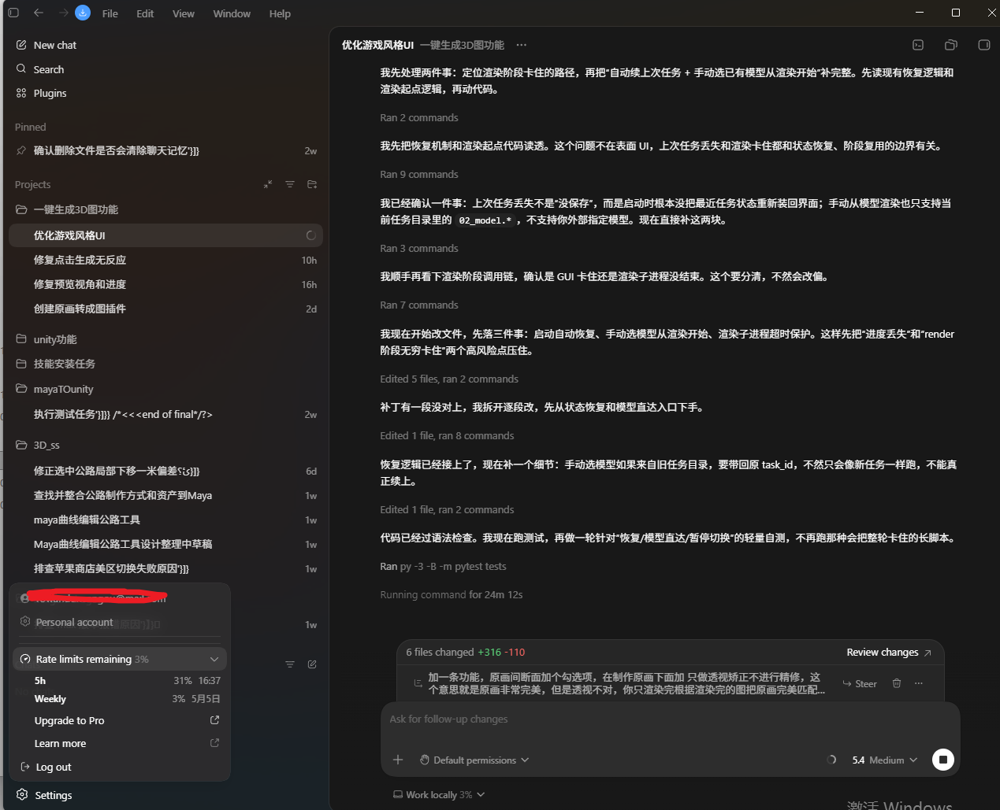

# AI Creator Workflow Proof

This repository is a public proof package for a Xiaomi MiMo Orbit 100T Creator Incentive application.

The project documents a real AI-assisted creation workflow centered on Codex: work plugins, browser mini-game engineering, UI and art/design tooling, and iterative debugging for frontend and 3D-related production tasks.

## Creator Profile

- Application email: `zhendongqi57@gmail.com`
- Primary agent tool: Codex
- Model families used: GPT, Claude, DeepSeek
- Xiaomi MiMo platform account: not registered yet
- Intended MiMo use: high-frequency agent coding, plugin development, mini-game engineering, UI iteration, and design-tool prototyping

## Work Areas

- Work plugins and productivity tools for repeated development tasks.
- Browser mini-game engineering, including gameplay loops, UI states, rendering flow, and test feedback.
- Art and design utilities for UI polishing, asset workflows, and 3D-related production helpers.
- Agent-assisted debugging, where Codex reads code, runs commands, edits files, tests behavior, checks screenshots, and iterates.

## Proof Screenshot

The screenshot below shows an active Codex development session. It includes iterative implementation, command execution, tests, change review, and follow-up fixes for a game-style UI and 3D workflow task.



## MiMo Usage Plan

MiMo API credits would make it possible to test larger and more realistic agent workflows instead of stopping at small prototypes. Planned usage:

- build reusable plugin and mini-game engineering templates;
- test MiMo in coding-agent tasks against GPT, Claude, and DeepSeek;
- create and refine art/design helper tools;
- run longer debugging and refactoring loops;
- document reliable workflows for future projects.

## Application Text

The Chinese application draft is in [`application-zh.md`](application-zh.md). The static proof page is [`index.html`](index.html).

## Publishing

This repository is ready to publish with GitHub CLI:

```powershell
cd M:\chatgpt_codex\my_project\mimo-orbit-creator-proof
.\publish-github.ps1 -Token "YOUR_GITHUB_TOKEN"
```

If GitHub CLI is already logged in on the machine, the token can be omitted:

```powershell
cd M:\chatgpt_codex\my_project\mimo-orbit-creator-proof
.\publish-github.ps1
```
